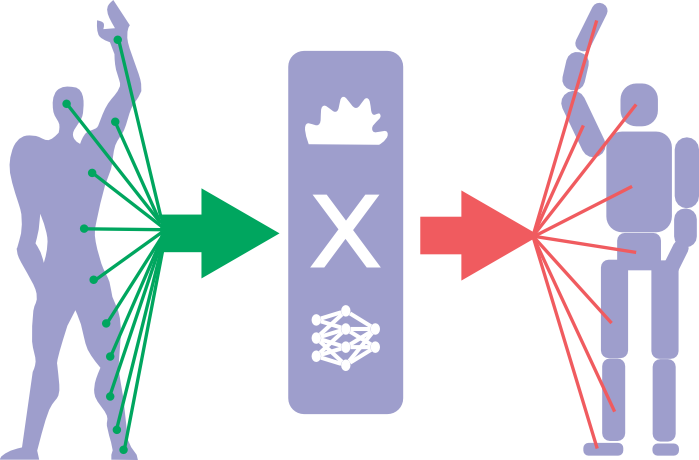

#Avatar project description

##Problem

There are several techniques and approaches to manage the robotic systems via neuronal activity, and current main
interest is concentrated in the prosthesis approaches, for example: http://www.youtube.com/watch?t=27&v=9NOncx2jU0Q
This approach is well known and rises one problem of caring the equipment on the body of humans.
More than that there are a lot of situations where the personal human presence is not possible or not wanted,
for example the zones of nature and technogenic disasters, outer space, extraterrestrial environments.
Using non anthropomorphic robotic systems could expand the application field of the neuromorphic robotic systems.
The diversity of the applications could be supported and expanded using the option to decouple the
managing neuronal activity and a robotic system.

##Idea

We propose the decoupling of managing and actuating activities in the form depicted below:

First to track the neuronal activity of the human body and on the human body then transform it into the
operational commands of the remote robotic system. This processing could be cloud based and done using
neuronal networks.

###Main components

We could identify following components:

1. **Filtering** the inbound neuronal activity to produce the valid spiking activity track.
1. **Sorting** the inbound neuronal activity identifying the originating cells that could be associated with the
desired actions of the robotic system.
1. **Normalization** the sorted activity of specific neurons to be translated to the commands of the robotic system.
1. **Translation** of the normalized neuronal activity into the robotic system managing commands.
1. **Transfer** the robotic system managing command via network to the remote robotic system.
1. Further feedback could be provided to the human operator in order to correct the management activity of the
operator.
