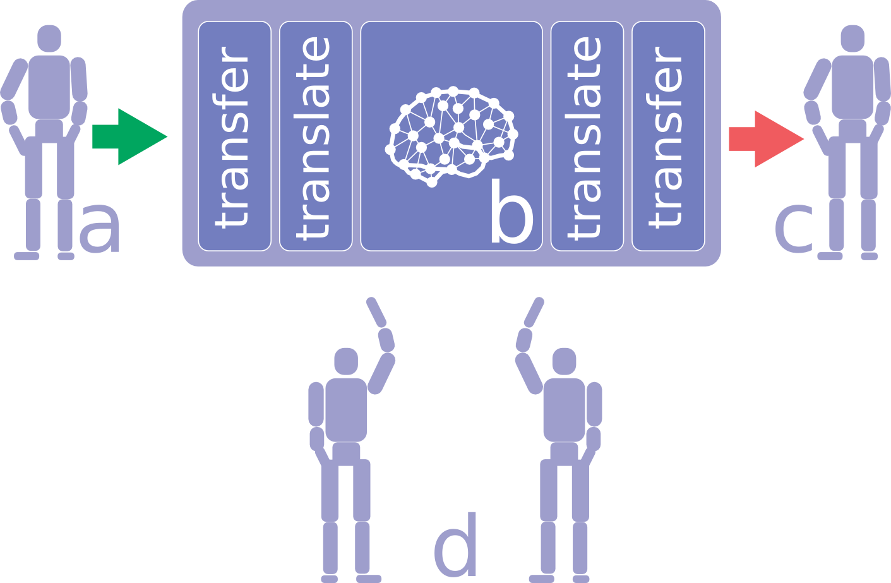

# Dream project intro

## Problem

In order to improve capabilities of autonomous robotic systems to deal with complex situations
(especially situations of humans interaction and social behaviour) advanced learning and behavioural models
including emotional reactions are needed. One of the most promising such models is Spiking Neural Networks
(with neuromodulation) as it's the most direct mapping of mammals' brain activity.
Current robotics systems usually do not have enough memory and computational capacity to run realistic
simulations of human brain activity.

For example this is computation resources of rather advanced bipedal robotic platform AR-601:

* CPU  - 4th Gen Intel® Core™ i7-4700EQ 4-Core 3.4GHz processor;
* System Memory -  1 x204-Pin DDR3L 1333MHz SO-DIMMup to 8 GB;

But simulation of 1% of human brain required a cluster of 250 K supercomputers that was done by RIKEN
institute in 2013 and this simulation was slower than human brain in 1000 times.
According to the estimates of the Human brain project the computational capacity to simulate whole human
brain is 1 exaflop that is not feasible at the moment.

In case of emotional behavioral simulations we probably need some intermediate layer to be stored and used on the robotic system and while realistic spiking NN should be used to generate this intermediate layer using
super-computer like Lomonosov.

## Solution

We propose to use "add one more layer of abstraction paradigm" that is depicted below:

Data structures:

- Lightweight ontology --- the data structure maintainable on a robotic system, usually contains facts, rules
and relations and reperesented as probabilistic ontology
- Spiking neural network (sNN) - used for simulation of the mammalian behavior and learning using real life
experience of the robotic system.

- a. In this position robotic system transfers the accumulated experience in the lightweight ontologies structures into sNN
- b. Processing is done as follows:
  - Firstly the accumulated experience in the form of light weight ontologies is transferred from a robotic system to  the processing center
  - Light weight ontologies should be translated in the form applicable to the sNN
  - Then applied to the sNN that is trained and is producing new updated behavior strategies during some period of time (over night) updating the neuronal circuits
  - Then updated neuronal circuits should be translated in the form of lightweight ontologies applied to the robotic system
- c. The updated lightweight ontologies are transferred to the robotic system and applied to it.
- d. The robotic system runs updated learning, appraisal and behavioral strategies in current environment and accumulate new experience to be processed again starting from a.

We propose to use two phases of the operation of the robotic system:
- **daily phase** - during this phase robotic system stores daily experience in the forms of the lightweight
ontologies and does minimal changes of a behavioral strategies. This phase is depicted as state **d**.
- **nightly phase** - robotic system transmits the daily experience in the processing sNN where realistic
learning, appraisal, coping and behavioral strategies is been generated and then transferred back in the form of lightweight ontologies. Depicted as: **a, b, c**.

## Development plan

1. Develop intermediate layer in probabilistic logic or better [NARS](https://github.com/opennars/opennars):
   2. Develop reasoning environment deployable on robotic system (ex: AR-601)
   2. Develop approach to NARS facts based description of: learning, appraisal, coping and
   behavioral strategies
1. Develop spiking NN (sNN) approach for of training and behavior including emotions
   2. Develop the sNN structure as the basement for the training, appraisal, coping and behavior
   2. Implement in the supercomputer simulation
   2. Develop sNN to NARS translation mechanism
1. Develop daily phase accumulating the daily experience and minimal changes of a behavioral strategies.

## Expected results

The following reseach to be done during the project:

1. Intermediate layer of the lightweight ontologies applicable to the NARS system.
1. Translation approaches to map lightweight ontologies data structures to the sNN and vice versa.
1. Description approach for the learning appraisal and behavioral strategies applicable for the lightweight
ontologies.
1. SNN structure sufficient to implement simulations of: learning, appraisal, coping and behavioral strategies

All the research results should be presented on the international conferences.

